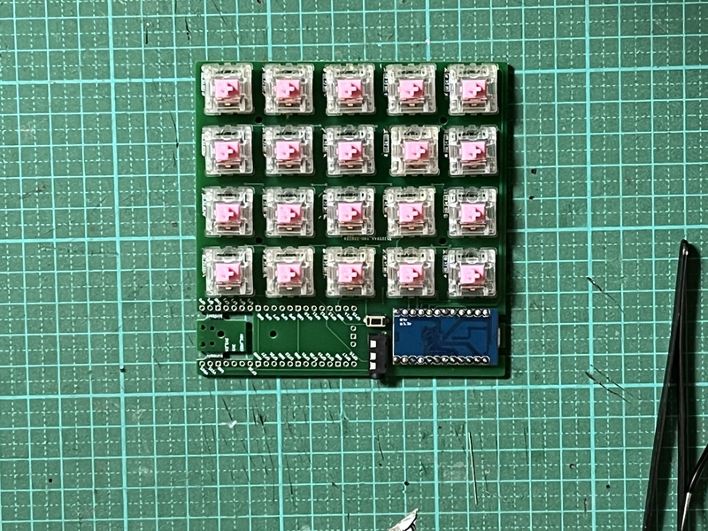

# Build guide

## Parts list

| No. | Patrs | Quantity | remarks | Suppliers | Cost |
|--|--|--|--|--|--|
|番号|名前|数|備考|調達先|参考価格（送料込）| 
|1|PCB|1|4X5Macro pad keyboard|[elecrow](https://www.elecrow.com) [JLCPCB](https://jlcpcb.com) [ALLPCB](https://www.allpcb.com)|５枚で10〜20ドル| 
||PCB|2|40%splite keyboard|↑|↑|
|2-1|Switch Plate スイッチプレート|１〜２|Macropadは１枚 splite keyboardは２枚|[工房Emerge+](https://www.emergeplus.jp/laser-cutting-service/contact/) [遊舎工房](https://yushakobo.jp) [elecrow](https://www.elecrow.com)|種類による。|
|2-2|Cover Plate カバープレート|１～２|↑|↑|↑|
|2-3|Bottom Plate ボトムプレート|１～２|↑|↑|↑|
|3|M2screw M2ネジ|4X1〜2|4mm CoverPlateで使用|DIYショップなど|10本で100円程度|
|4|M2screw M2ネジ|4X1〜2|3mm|↑|↑|
|5A|M2screw M2ネジ|4X1〜2|8mm MXスイッチ使用時|↑|↑|
|5B|M2screw M2ネジ|4X1〜2|6mm chocスッチ使用時|↑|↑|
|6A|M2spacer M2スペーサー|8X1〜2|3mmメス-メス MXスイッチ使用時|[ヒロスギネット](https://www.hirosugi-net.co.jp/shop/c/c10/) [遊舎工房](https://yushakobo.jp)|20本で800円程度|
|6B|M2spacer M2スペーサー|4X1〜2|3mmメス-メス chocスイッチ使用時|[ヒロスギネット](https://www.hirosugi-net.co.jp/shop/c/c10/) [遊舎工房](https://yushakobo.jp)|20本で800円程度|
|6|M2spacer M2スペーサー|2X1〜2|6mmメス-メス CoverPlateで使用|[ヒロスギネット](https://www.hirosugi-net.co.jp/shop/c/c10/) [遊舎工房](https://yushakobo.jp)|20本で800円程度|
|7|pro micro|1〜2|ピンヘッダも別途購入|[遊舎工房](https://yushakobo.jp) [Talp Keyboard](https://talpkeyboard.net) [Daily Craft Keyboard](https://shop.dailycraft.jp)等|価格変動中|
||Raspberry Pi Pico|1〜2|ピンヘッダも別途購入|[遊舎工房](https://yushakobo.jp)等|１個550円|
|8|Swith socket スイッチソケット|20X1〜2|cherry MX互換|[遊舎工房](https://yushakobo.jp) [Talp Keyboard](https://talpkeyboard.net) [Daily Craft Keyboard](https://shop.dailycraft.jp)等|10個で165円程度|
||Swith socket スイッチソケット|20X1〜2|choc互換|[遊舎工房](https://yushakobo.jp) [Talp Keyboard](https://talpkeyboard.net) [Daily Craft Keyboard](https://shop.dailycraft.jp)等|10個で165円程度|
|9|Diode ダイオード|20X1〜2|リードタイプでもSMDでも可|[遊舎工房](https://yushakobo.jp) [Talp Keyboard](https://talpkeyboard.net) [Daily Craft Keyboard](https://shop.dailycraft.jp)等|100個で220円程度から|
|10|タクトスイッチ|1〜2|２本足のもの|[遊舎工房](https://yushakobo.jp) [Talp Keyboard](https://talpkeyboard.net) [Daily Craft Keyboard](https://shop.dailycraft.jp)等|１個11円程度|
|11|TRRSジャック|1〜2|MJ-4PP-9|[遊舎工房](https://yushakobo.jp) [Talp Keyboard](https://talpkeyboard.net) [Daily Craft Keyboard](https://shop.dailycraft.jp)等|１個55円|

この他に、TRRSケーブル、USBケーブル、キーキャップ等が必要です。

## Firmware

### 1 PRK_FIRMWARE

[Here](https://github.com/telzo2000/cool640/tree/main/firmware)

 
For those who are introducing PRK for the first time.
 
初めてのPRKを導入する方に
 
Only Japanese tweets.
 
日本語ツイートのみです。
 

https://twitter.com/0002ozlet/status/1512535045957111810

### 2 QMK_FIRMWARE
[Here](https://github.com/telzo2000/cool640/tree/main/firmware)

 

## Build 1(PCB only)

### 1 Parts check

Front side（表面）

Back side（裏面）

### 2 Diode soldering

Solder the diode on the back side.
 
裏面にダイオードのハンダ付けをします。
 

There are lead type and SMD diodes.
 
ダイオードはリードタイプか、SMDがあります。
 
Here, we will explain the lead type soldering.
 
ここでは、リードタイプのハンダ付けの説明をします。
 
However, those who adopt the choc switch should use SMD diodes.
 
ただし、chocスイッチを採用する人は、SMDのダイオードを使用してください。
 

Use a lead bender to bend the legs of the diode.
 
リードベンダーを使い、ダイオードの足を曲げます。
 

Insert the diode into the board.
 
ダイオードを基板に挿しこみます。
 

Please refer to the image and pay attention to the orientation of the diode.
 
画像を参考にして、ダイオードの向きに注意してください。
 

Secure the diode with masking tape, then face up.
 
マスキングテープでダイオードを固定してから、表面を上にします。
 
Solder the protruding legs.
 
はみ出ている足部分に、ハンダ付けをします。
 
After soldering, use nippers to cut off the protruding legs.
 
はんだ付けが終わったら、はみ出ている足をニッパーで切り取ってください。
 

[８倍速　Diodeハンダ付け動画](https://youtu.be/Yaodh2-XxV4)

 
 

### 3 Soldering switch sockets

Solder the switch sockets on the back side.
 
裏面にスイッチソケットのハンダ付けをします。
 
cool640 is compatible with both choc and cherry MX switches.
 
cool640はchocスイッチとcherryMXスイッチの両方に対応しています。
 
Both can be installed.
 
両方を取り付けることが可能です。
 
Here, solder the cherryMX switch.
 
ここでは、cherryMXスイッチのハンダ付けを行います。
 
Place the switch socket so that the letters MX are hidden.
 
MXという文字が隠れるように、スイッチソケットを乗せてください。
 
That is the correct switch socket orientation.
 
それが正しいスイッチソケットの向きになります。
 
When using a choc switch, place the switch socket so that the letters choc are hidden.
 
chocスイッチの時は、chocという文字が隠れるように、スイッチソケットを乗せてください。
 

Apply solder to both pads.
 
両方のパッドにハンダを盛ります。
 
Place the switch socket and fix it with a warm soldering iron while melting the solder.
 
スイッチソケットを乗せて、温めたハンダゴテで、ハンダを溶かしながら、固定します。
 
You can make it easier by working while holding it with tweezers.
 
ピンセットで押さえながら、作業をすると楽にできます。
 

[８倍速　Switch socketハンダ付け動画](https://youtu.be/E__mHvmIXQo)

  

### 4 Soldering reset switch & TRRS jack 

Insert the reset switch on the surface.
 
表面にリセットスイッチを挿しこみます。
 
Solder the legs of the reset switch from the back.
 
裏面からリセットスイッチの足をハンダ付けします。
 
Solder the TRRS jack in the same way near the reset switch.
 
TRRSジャックは、リセットスイッチの近くに同じようにハンダ付けします。

[８倍速　Reset switch,TRRS jackハンダ付け動画](https://youtu.be/3gEbExaOAv4)

  

### 5　Choice of Pro micro or Raspberry Pi Pico

You can run cool640 in either Pro micro or Raspberry Pi Pico.
 
cool640をpro microかラズパイピコのどちらか一方で動作させることができます。
 
＜case 1＞
 
When you choose Pro micro, place it on the left side of the TRRS jack.
 
pro microを選んだ時、TRRSジャックの左側にpro microを取り付けてください。
 

Use the conthrough to fix the pro micro with the side with the parts facing down.
 
pro microの部品のある面を下向きに、コンスルーを使い、固定してください。
 

Pay attention to the orientation of the conthrough.
 
コンスルーの向きに注意してください。
 

If the USB port touches the PCB, cut off the part on the left side of the PCB.
 
もし、USB端子がPCBに接触するならば、PCBの左側の一部を切りとってください。
 

＜case 2＞
 
When you choose Raspberry Pi Pico, place it on the right side of the TRRS jack.
 
ラズパイピコを選んだ時、TRRSジャックの右側にラズパイピコを取り付けてください。

Use the conthrough to fix the Raspberry Pi Pico with the side with the parts facing down.
 
ラズパイピコの部品のある面を下向きに、コンスルーを使い、固定してください。
 

Pay attention to the orientation of the conthrough.
 
コンスルーの向きに注意してください。
 

If the USB port touches the PCB, cut off the part on the right side of the PCB.
 
もし、USB端子がPCBに接触するならば、PCBの右側の一部を切りとってください。
 

 

### 6　Test

Please write the firmware and check the operation.
 
ファームウェアを書き込んで、動作確認をしてください。
 

Install a switch or measure continuity with tweezers, etc.
 
スイッチを取り付けるか、ピンセット等で導通をはかるかを行います。
 

### PRK_FIRMWARE

[Here](https://github.com/telzo2000/cool640/tree/main/firmware)

 

### QMK_FIRMWARE
[Here](https://github.com/telzo2000/cool640/tree/main/firmware)

 
 

### 7 Installation of key switch

Attach your favorite key switch.
 
好きなキースイッチを取り付けてください。
 

 
 

### 8 Installation of key cap

Attach your favorite key cap.
 
好きなキーキャップを取り付けてください。
 

 
If you like, attach a rubber cushion to the back and you're done.
 
お好みで裏面にラバークッションを取り付けたら、完成です。
 
 
 

## Build 2(Acrylic sandwich mount case)

After 1 ~ 6 of build1, please do the next step.
 
build1の1~6の後、次の工程をしてください。
 

### 1 Installation of cover plate

Prepare a cover plate, M2 spacer 6mm（x２）, and M2 screw 3mm（x４）.
 
カバープレート、M2スペーサー6mm（２個）、M2ネジ3mm（４本）を用意します。
 
Screw the spacer to the cover plate in the same orientation.
 
カバープレートに同じ向きで、スペーサーをネジで固定します。
 
Then use the remaining screws to attach the cover plate to the PCB.
 
次に、残りのネジを使い、カバープレートをPCBに取り付けます。
 
There is an orientation of the cover plate, so it is good to check it once before starting work.
 
カバープレートの向きがあり、作業前に一度、重ねて確認すると良いです。
 
 

### 2-1 Installation of switch plate（choc switch）

Prepare a switch plate, M2 spacer 3 mm（x４）, and M2 screw 6 mm（x４）.
 
スイッチプレート、M2スペーサー３mm（４本）、M2ネジ６mm（４本）を用意します。
 
Fix the screws in 4 places.
 
ネジを４箇所、固定します。
 
Insert the screws in the order of the switch plate and the PCB, and fix them with spacers on the back of the PCB.
 
ネジはスイッチプレート、PCBの順でさしこみ、PCBの裏面でスペーサーで固定します。
 

 

### 2-2 Installation of switch plate（cherry MX switch）

Prepare a switch plate, M2 spacer 3 mm（x８）, and M2 screw 8 mm（x４）.
 
スイッチプレート、M2スペーサー３mm（８本）、M2ネジ８mm（４本）を用意します。
 
Fix the screws in 4 places.
 
ネジを４箇所、固定します。
 
Insert the switch plate into the screw and fix it with a spacer.
 
ネジはスイッチプレートをさしこみ、スペーサーで固定します。
 
Next, insert the switch plate into the PCB and secure it with a spacer on the back of the PCB.
 
次に、スイッチプレートをPCBにさしこみ、PCBの裏面でスペーサーで固定します。
 

### 3 Installation of bottom plate 

Prepare the bottom plate and M2 ３mm screws（x４）.
 
ボトムプレート、M２ネジ３mm（４本）を用意します。
 
Place the bottom plate according to the spacer on the back of the PCB and fix it with screws.
 
PCB裏面にあるスペーサーに合わせて、ボトムプレートをのせて、ネジで固定します。
 
 
From here, proceed with step 7 of build1.
 
ここからは、build１の７の工程を進めてください。
 

Right:Raspberry Pi Pico & choc switch
 
Left :Pro micro & cherry MX switch

From the side

 

Have a fun selfmade keyboard life!
 
楽しい自作キーボード生活を!

